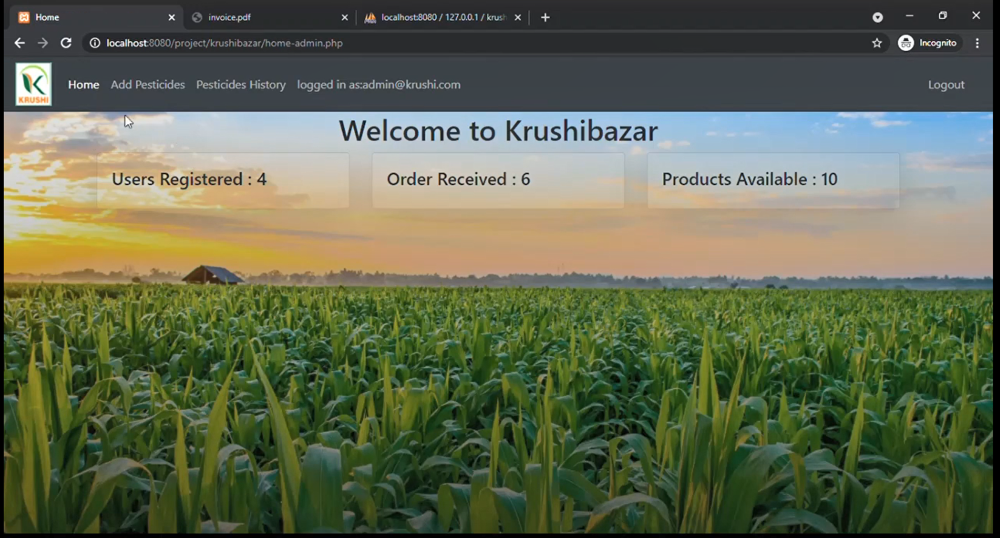

# krushibazar

Table of Contents

  <ol>
    <li>
      <a  href="#about-the-project">About The Project</a>
    </li>
  </ul>
  </li>
  <li><a  href="#contact">Functionalities</a></li>
  <li><a  href="#contact">Contact</a></li>
  <li><a  href="#acknowledgements">Acknowledgements</a></li>
  </ol>

## About The Project

KrushiBazar is a Online Famrers Platform Where Farmers can buy/sell crops and also KrushiBazar provides its own pesticides which farmers can use.

## Functionalities

We have two user categories:

- Admin
- User

Each functionality mentioned below is bundled with a user category and can be accessed by login into the particular user category.

1. User Registration
   - For taking details about a new user.
   - Check if all the mandatory details are entered and are in proper acceptable format.
   - If everything is in acceptable format then register the user.
2. User Login
   - Take email and password from the user and validate the user.
   - Admin Login
   - Login to access the admin functionalities.
   - Take email and password and validate to access as admin.
3. Sell Crop
   - Accessible is User Login only.
   - Takes inputs such as crop name,price, quantity, image etc from the user.
   - Validates each input to the acceptable type and then if everything is in order then adds the crop.
4. Update Crop
   - Accessible in User Login only.
   - User can edit only that crop which he/she has added.
   - Upon selecting the crop to edit, the user must provide \* new quantities to add and can edit description.
     If everything is in order then the crop is updated.
5. Sell Pesticide
   - Accessible is Admin Login only.
   - Takes inputs such as Pesticide name,price, quantity,image etc from the admin.
   - Validates each input to the acceptable type and then if everything is in order then adds the Pesticide.
6. Update Pesticide
   - Accessible in Admin Login only.
   - Upon selecting the Pesticide to edit, the Admin must provide new quantities to add and can edit description.
   - If everything is in order then the Pesticide is updated.
7. Buy Product
   - Accessible in User Login only.
   - A list of all the products,comprising crops which are not added by the current user and pesticides added by the admin, is displayed.
   - The user must add the product he/she wants to buy to the cart.
   - A product already in cart cannot be added again.
8. User Cart Management
   - Accessible in User Login only.
   - Displays all the products the user has entered in his/her cart.
   - Users can increment/ decrement/ remove products from the cart.
   - In case a product in users cart is sold out before the user checks out then the product is moved to a Saved for Later Category.
     - The product in the Saved for Later category can be again added to the cart with the quantity available( if the available quantity is 0 then this is not possible).
     - If the user doesn't want to do this then he/she must remove the product.
   - Users can then Checkout from here to order the products in cart.
9. Ordering
   - Accessible in User Login only.
   - The user must checkout from the Cart in order to order the products.
   - There must be no Saved for later Product in order to checkout.
   - If everything is in order then the user will be prompted to enter address and card details to proceed with the checkout process.
   - If Everything is in order then the order is placed and a bill PDF is generated.
10. View Bills
    - Accessible in User Login only.
    - A list of all the orders placed by the user will be shown.
    - Users can select any one order to view its bill with an additional functionality to review the products comprising the bill.
11. Review Product
    - Accessible in User Login only.
    - The user can see the reviews provided by other users in the form of comments, average rating( out of 5) and number of 5stars,4stars etc.
    - Also users can give the review to a product by visiting the bill comprising the product and then clicking on review.
    - If a user has already reviewed the product then his/her review is shown and then he/she can edit it, and in other cases a new review will be added.
12. User Profile management
    - Accessible in User Login only.
    - Display the User details available.
    - Users can either change the details or change his/her password.
    - In either case the new details are verified and if everything are in order then the details are updated.
13. Company portfolio Management
    - Accessible in Admin Login only.
    - Shows the following statistics
      - Number of users registered,
      - Number of products available,
      - Number of orders generated till date.

## Contact

Hrujul Thumar - [@HrujulThumar22](https://github.com/HrujulThumar22) - 18BCE077@nirmauni.ac.in

Gaurav Vaghasiya - [@gvaghasiya02](https://github.com/gvaghasiya02) - 18BCE070@nirmauni.ac.in

Gaurav Parekhiya - [@GauravParekhiya](https://github.com/GauravParekhiya) - 18BCE071@nirmauni.ac.in

## Acknowledgements

- We would like to express our special thanks of gratitude to our faculties <b>Mr. Ajay Patel</b> and <b>Mr. Dvijesh Bhatt</b> who gave us the golden opportunity to do this wonderful project on the topic <b>KrushiBazar</b>.
